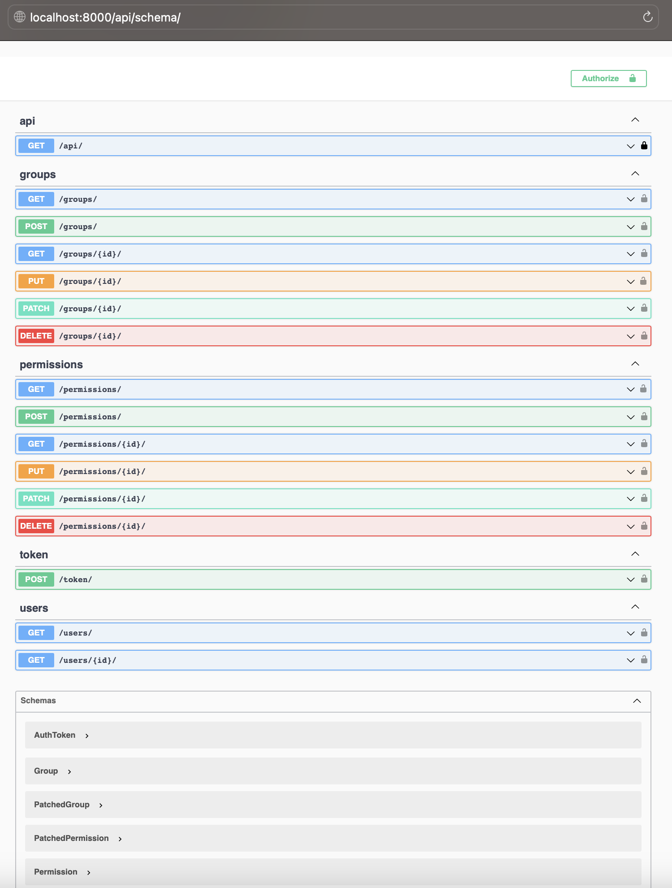

## Dynamic Permission System with Django Rest Framework
The system allow the assignment of Groups or Permissions to generic users. 
Users will be able to assign one or more groups, both system and custom, and in addition to the groups, specific permissions can also be assigned. 
Based on the groups and permissions assigned to the user, they will be able to perform certain actions.

## ERD schema (graphical representation of the database)

### Users
Can only use "GET" & "PATCH" methods to list & update users. They are not managed with DRF.
A user can be assigned one or more groups, and one or more specific permissions can also be assigned. 
Therefore, individual permissions assigned to users take precedence over those of the groups.

### Groups
There will be a system group that cannot be modified, called "SuperAdmin" which will perform as it has all platform permissions.
Users in this group are superusers. Only superusers can add users to the SuperAdmin group.
A user with sufficient permissions can create a custom group. 
 
A group is represented by the following fields:
- group name
- permissions associated with the group
- users belonging to the group

### Permissions
A user with sufficient permissions can add, in available groups, permissions related to the permissions 
currently available to the user, and equal to or lower in degree among the available permissions.

A permission is represented by the following fields:
- name
- type of permission (create, edit, delete, view)
- associated specific resource (optional), if null then it is a class permission
- degree, which is an inversely ordered number indicating the hierarchy among permissions. The larger it is, the more it concerns specific resources, the smaller it is, the more it concerns general resources.

Permissions can be of two types:
- Class permissions are pre-existing in the platform and therefore concern all entities present in the platform itself.
- Instance permissions, on the other hand, are created automatically at the creation of any resource that requires a permission (so everything), and therefore represent the ability to perform one of the 4 possible actions, already described above, on the specific resource.

## Set-up

Create & activate a virtual environment for the project after having cloned the repo
> python -m venv venv 
> source venv/bin/activate

Install required dependencies
> pip install -r requirements.txt

Make migrations
> python manage.py migrate

Load initial data
> python manage.py loaddata superadmin_data.json

Create superuser
> python manage.py createsuperuser

Start the backend server
> python manage.py runserver

## API calls

### Swagger documentation

### Authentication
Each user should be associated with a token key in order to be able to make calls in the system. 
This can be done beforehand within Admin Panel or through terminal with this command:
> python manage.py drf_create_token < username >

for example for admin user: 
> python manage.py drf_create_token admin

Call the token url with correct username and password and get back the token to be used in continuance for other calls.

### Token authorised CRUD operations dependent on permissions assigned

